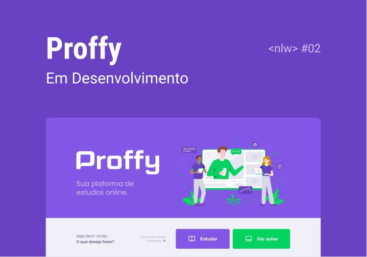

# NLW2-Proffy
<p align="center">
  

  

  

  
    
  

 
</p>
<h1 align="center">
    
</h1>

<h3 align="center"> 
	🚧  Proffy 👨‍🏫 Finalizado 🚀 🚧
</h3>

<p align="center">
 <a href="#-sobre-o-projeto">Sobre</a> •
 <a href="#-funcionalidades">Funcionalidades</a> •
 <a href="#-como-executar-o-projeto">Como executar</a> • 
 <a href="#-tecnologias">Tecnologias</a> •  
 <a href="#-autor">Autor</a> • 
 <a href="#user-content--licença">Licença</a>
</p>


## 💻 Sobre o projeto

👨‍🏫 Proffy - foi um projeto desenvolvido durante a **NLW 2 - Next Level Week 2** oferecida pela [Rocketseat](https://blog.rocketseat.com.br/primeira-next-level-week/) de forma gratuita.

O projeto visa a criação de uma aplicação capaz de conectar professores, que estão disponíveis para lecionar particularmente em dias e horários pré-definidos por eles durante seu cadastro na plataforma, com alunos que necessitam aprender.

---

## ⚙️ Funcionalidades

- 👨‍🏫: Professores podem se cadastrar na plataforma web/mobile enviando:
  - ✔️ Nome
  - ✔️ Foto
  - ✔️ Whatsapp para contato
  - ✔️ Biografia
  - ✔️ Disciplinas em que desejam lecionar
  - ✔️ O custo da hora/aula
  - ✔️ Dias e horários disponíveis

- 👨‍🎓 Os estudantes tem acesso ao aplicativo web/mobile, onde podem:
  - ✔️ Podem pesquisar por disciplina, data e horário específico
  - ✔️ Obter informações sobre o professor
  - ✔️ entrar em contato com o professor através do WhatsApp

---

## 🚀 Como executar o projeto

Este projeto é divido em duas partes:
1. Backend
2. Frontend

💡Para o Frontend funcionar é necessário que o Backend esteja sendo executado.

### Pré-requisitos

Antes de começar, você vai precisar ter instalado em sua máquina as seguintes ferramentas:
[Git](https://git-scm.com), [Node.js](https://nodejs.org/en/). 
Além disto é bom ter um editor para trabalhar com o código como [VSCode](https://code.visualstudio.com/)


#### 🧭 Rodando a aplicação

```bash

# Clone este repositório
$ git clone https://github.com/Dhi-Carvalho/NLW2-Proffy.git

# Acesse a pasta do projeto no seu terminal/cmd
$ cd NLW2-Proffy

# Instale as dependências
$ npm install

# Execute a aplicação em modo de desenvolvimento
$ npm run dev

# A aplicação será aberta na porta:5500 - acesse http://localhost:5500

```

---

## 🛠 Tecnologias

As seguintes ferramentas foram usadas na construção do projeto:

#### **Frontend**

- **HTML5**
- **CSS3**
- **JavaScript**

#### **Server**

-   **[Nodejs](https://nodejs.org/en/)**
-   **[Express](https://expressjs.com/)**
-   **[SQLite-Async](https://www.npmjs.com/package/sqlite-async)**
-   **[Nunjucks](https://mozilla.github.io/nunjucks/)**
-   **[Nodemon](https://www.npmjs.com/package/nodemon)**


> Veja o arquivo  [package.json](https://github.com/Dhi-Carvalho/NLW2-Proffy/blob/main/package.json)

**Utilitários**

-   Protótipo:  **[Figma](https://www.figma.com/)**  →  **[Protótipo (Proffy)](https://www.figma.com/file/VwAMESLuxk8Hlt5rtuuKiz/Proffy)**
-   API:  **[Whatsapp API](https://api.whatsapp.com/)**
-   Editor:  **[Visual Studio Code](https://code.visualstudio.com/)**  → Extensions:  **[SQLite](https://marketplace.visualstudio.com/items?itemName=alexcvzz.vscode-sqlite)**
-   Markdown: **[Markdown Emoji](https://gist.github.com/rxaviers/7360908)**
-   Ícones:  **[Feather Icons](https://feathericons.com/)**,  **[Font Awesome](https://fontawesome.com/)**
-   Fontes:  **[Archivo](https://fonts.google.com/specimen/Archivo)**,  **[Poppins](https://fonts.google.com/specimen/Poppins)**


---

## :man_student: Autor

 <h1 align="center">
    
</h1>

<p align="center">


</p>

---

## 📝 Licença

Este projeto esta sobe a licença [MIT](https://github.com/Dhi-Carvalho/NLW2-Proffy/blob/main/License).

Feito com por Dhi Carvalho 👋🏽 [Entre em contato!](https://www.linkedin.com/in/dhi-carvalho/)

---
